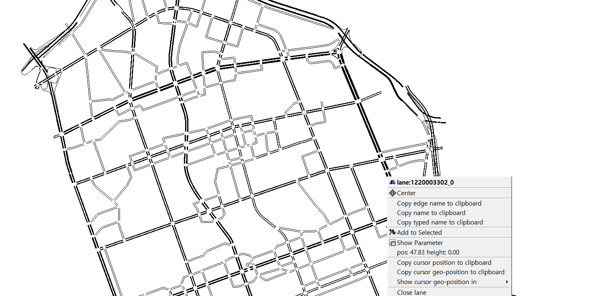
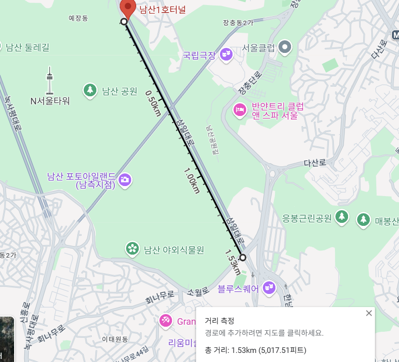
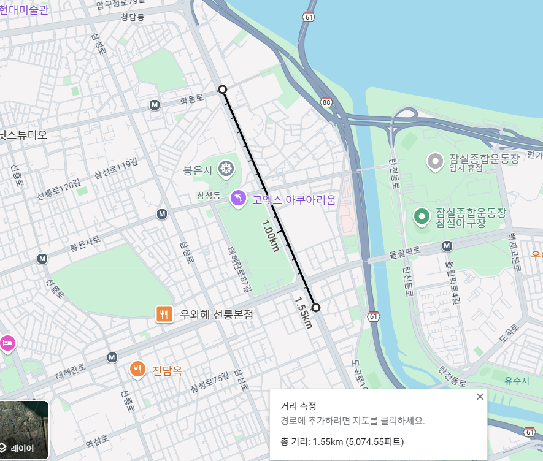

## 디렉토리 구조


`Bakend` : python 코드 및 csv파일 ( 데이터 필터링 및 전처리 후 react로 넘김)<br>
`Frontend` : react 기반 js 코드<br>
`Sumo` : sumo 시뮬레이션을 돌리기위한 설정 파일들 및 돌리는데 사용한 코드


## 1. namsan 디렉토리
<br>

 


<br>

## 2. sumo 디렉토리

### 강남 교통 데이터 분석

[gangnam.net.xml](sumo/gangnam.net.xml)

강남 도로 데이터

[edgedata_day_avg.xml](sumo/dgedata_day_avg.xml)

실제 하루 평균 강남 도로 교통량 데이터

```bash
python "%SUMO_HOME%\\tools\\randomTrips.py" -n gangnam.net.xml -r sampleRoutes.rou.xml
```

[sampleRoutes.rou.xml](sumo/sampleRoutes.rou.xml)

randomTrips 파이썬 명령어로 생성한 차량 루트 파일

```bash
python "%SUMO_HOME%\\tools\\routeSampler.py" -r sampleRoutes.rou.xml --edgedata-files edgedata_day_avg.xml -o sampleOutput_day_avg_.xml
```

[sampleOutput_day_avg.zip](sumo/sampleOutput_day_avg.zip)

하루 평균 강남 교통량 데이터와 차량 루트 파일을 기반으로 만든 시뮬레이션 차량 데이터


[gangnam.sumocfg](sumo/gangnam.sumocfg)

sumo 시뮬레이션을 돌리기 위한 sumocfg파일

```xml
<?xml version="1.0" encoding="UTF-8"?>

<additional>
    <edgeData id ="0" file="edgeData0/edge0.xml" begin="0" end="3600" excludeEmpty="true"/>
    <edgeData id ="1" file="edgeData0/edge1.xml" begin="3600" end="7200" excludeEmpty="true"/>
    <edgeData id ="2" file="edgeData0/edge2.xml" begin="7200" end="10800" excludeEmpty="true"/>
    <edgeData id ="3" file="edgeData0/edge3.xml" begin="10800" end="14400" excludeEmpty="true"/>
    <edgeData id ="4" file="edgeData0/edge4.xml" begin="14400" end="18000" excludeEmpty="true"/>
    <edgeData id ="5" file="edgeData0/edge5.xml" begin="18000" end="21600" excludeEmpty="true"/>
    <edgeData id ="6" file="edgeData0/edge6.xml" begin="21600" end="25200" excludeEmpty="true"/>
    <edgeData id ="7" file="edgeData0/edge7.xml" begin="25200" end="28800" excludeEmpty="true"/>
    <edgeData id ="8" file="edgeData0/edge8.xml" begin="28800" end="32400" excludeEmpty="true"/>
    <edgeData id ="9" file="edgeData0/edge9.xml" begin="32400" end="36000" excludeEmpty="true"/>
    <edgeData id ="10" file="edgeData0/edge10.xml" begin="36000" end="39600" excludeEmpty="true"/>
    <edgeData id ="11" file="edgeData0/edge11.xml" begin="39600" end="43200" excludeEmpty="true"/>
    <edgeData id ="12" file="edgeData0/edge12.xml" begin="43200" end="46800" excludeEmpty="true"/>
    <edgeData id ="13" file="edgeData0/edge13.xml" begin="46800" end="50400" excludeEmpty="true"/>
    <edgeData id ="14" file="edgeData0/edge14.xml" begin="50400" end="54000" excludeEmpty="true"/>
    <edgeData id ="15" file="edgeData0/edge15.xml" begin="54000" end="57600" excludeEmpty="true"/>
    <edgeData id ="16" file="edgeData0/edge16.xml" begin="57600" end="61200" excludeEmpty="true"/>
    <edgeData id ="17" file="edgeData0/edge17.xml" begin="61200" end="64800" excludeEmpty="true"/>
    <edgeData id ="18" file="edgeData0/edge18.xml" begin="64800" end="68400" excludeEmpty="true"/>
    <edgeData id ="19" file="edgeData0/edge19.xml" begin="68400" end="72000" excludeEmpty="true"/>
    <edgeData id ="20" file="edgeData0/edge20.xml" begin="72000" end="75600" excludeEmpty="true"/>
    <edgeData id ="21" file="edgeData0/edge21.xml" begin="75600" end="79200" excludeEmpty="true"/>
    <edgeData id ="22" file="edgeData0/edge22.xml" begin="79200" end="82800" excludeEmpty="true"/>
    <edgeData id ="23" file="edgeData0/edge23.xml" begin="82800" end="86400" excludeEmpty="true"/>
</additional>

```

[add.edge.xml](sumo/add.edge.xml)

0~3600 1시간 단위로 시뮬레이션 데이터를 총 24시간 하루를 저장하도록 설정

영동대로 통행료 적용 구역 도로 id 데이터-district.xml

[yeongdong_district.xml](sumo/districts/yeongdong_district.xml)


### 영동대로 통행료 부과 선정 이유


요금 없이 시뮬레이션 돌리는 파이썬 코드

[noToll.py](sumo/noToll.py)

```xml
<meandata xmlns:xsi="http://www.w3.org/2001/XMLSchema-instance" xsi:noNamespaceSchemaLocation="http://sumo.dlr.de/xsd/meandata_file.xsd">
    <interval begin="0.00" end="3600.00" id="0">
        <edge id="1210005600" sampledSeconds="52.96" traveltime="26.18" overlapTraveltime="26.96" density="0.05" laneDensity="0.05" occupancy="0.03" waitingTime="0.00" timeLoss="10.79" speed="10.72" speedRelative="0.77" departed="2" arrived="0" entered="0" left="2" laneChangedFrom="0" laneChangedTo="0"/>
        <edge id="1210005702" sampledSeconds="74.78" traveltime="5.84" overlapTraveltime="6.23" density="0.31" laneDensity="0.10" occupancy="0.05" waitingTime="0.00" timeLoss="10.66" speed="11.54" speedRelative="0.83" departed="0" arrived="0" entered="12" left="12" laneChangedFrom="10" laneChangedTo="10"/>
      ...
```

[edge0.xml](sumo/edgeData0/edge0.xml)

- **id**: 도로의 고유 식별자입니다.
- **sampledSeconds**: 샘플링된 시간(초)입니다.
- **traveltime**: 도로를 통과하는 데 걸린 시간(초)입니다.
- **overlapTraveltime**: 중첩된 구간을 포함한 통과 시간(초)입니다.
- **density**: 도로의 밀도(차량/미터)입니다.
- **laneDensity**: 차선별 밀도(차량/미터)입니다.
- **occupancy**: 도로 점유율(%)입니다.
- **waitingTime**: 대기 시간(초)입니다.
- **timeLoss**: 시간 손실(초)입니다.
- **speed**: 평균 속도(m/s)입니다.
- **speedRelative**: 상대 속도(기준 속도 대비 비율)입니다.
- **departed**: 출발한 차량 수입니다.
- **arrived**: 도착한 차량 수입니다.
- **entered**: 진입한 차량 수입니다.
- **left**: 떠난 차량 수입니다.
- **laneChangedFrom**: 차선 변경 전 차량 수입니다.
- **laneChangedTo**: 차선 변경 후 차량 수입니다.

[결과 파일 분석 colab link](https://colab.research.google.com/drive/1QQ1hrfTCJkecOmYPCorwv8AiBK57ETrK#scrollTo=kcKlb9iwoFoz)

가장 데이터가 수집된 시간이 긴 도로 id: 1220034102

가장 진입한 차량 수가 많았던 도로 id: 1220003302

가장 지나친 차량 수가 많았던 도로 id: 1220003302



영동대로에서 진입 및 지나친 차량 수 최대







남산과 유사하게 1.5km구간 선정

### 요금책정


출처: 보건복지부

2023년 남산 데이터와 비교를 위해 2023년 1인 기준 중위 소득을 기준으로 요금에 대한 비용 계산

하루 기준 근로 시간=8시간

요금→ 시간 비용

도로 위 차량들은 최단 시간으로 목적지에 도달하기 위한 경로를 선택한다고 가정


### 역삼로 통행료 부과

영동대로 요금 부과 결과 통행료의 크기가 결과에 영향을 주지 못함

또한 5차선인 영동대로는 통행료에 영향을 별로 받지 않았을 거라고 추정하여 

2차선인 역삼로에 통행료를 부과해보기로 결정


<br>

## 3. backend 디렉토리
<br>

backend 디렉토리로 이동 후 아래 명령어를 입력하면 됩니다.

1. 가상환경 생성 및 실행(윈도우)
    ```console
    python -m venv venv
    .\venv\Scripts\Activate.ps1
    ```
2. 프로젝트 디렉토리 이동 후 라이브러리 설치
    ```console
    cd project
    pip install -r requirements.txt 
    ```
    파이썬 라이브러리 버전 충돌시, 아래 명령어로 패키지 설치 진행
    ```console
    pip install flask pandas pyproj flask_cors
    ```
3.  플라스크 프로세스 실행
    ```console
    flask --deubg run
    ```

**서버 프로세스가 돌아가는 상태에서 다음 frontend 실행을 진행해야합니다.**

<br>

백엔드 서버의 기능 
- sumo 시뮬레이션에 사용한 강남 네트워크 파일을 로드해서 좌표평면으로 표시되어있는 각 도로의 데이터를 위도,경도인 geoJson형식의 데이터로 변환후 react에 전달
- sumo 시뮬레이션의 결과로 나온 csv파일을 바탕으로 각 도로별 통행량, 속도, 시간별 통행량과 속도 데이터를 react에 전달


<br>

## 4. frontend 디렉토리

<br>

1. 프로젝트 디렉토리 이동 후 필요 라이브러리 설치
    ```console
    cd project
    npm install
    ```
2. react 배포
    ```console
    npm start
    ```
3. http://localhost:3000 접속


### 시각화 방식

`지도 시각화`

- 2개의 지도를 두고 사용자가 통행료를 부과했을때 어떤 차이가 있는지 비교분석 가능하도록 구현하였습니다.

- 각 지도위에 교통량을 기준으로 색상을 이용하여 통행량이 많고 적음을 한눈에 알아볼 수 있도록 구현하였습니다.

- 툴팁으로 해당 edge의 통행량 및 속도를 확인할 수 있습니다.

- 요금부과시 미리 해당 도로가 어디에 위치해 있는지 파악하고 부과할 수 있습니다.

<br>

`시간대별 통행량,속도 그래프`

- 시간대별 통행량의 경우 실제 사용자가 특정 구간에만 통행료를 부과하는 정책도 적용할 수 있도록 시간대 별로 어느 구간이 영향이 가장 컸는지를 보여줄 수 있도록 구현하였습니다.

- 시간대별 속도의 경우 해당 시간대에 통행량의 변화량이 속도에는 어떤 영향을 미치는지 보여주기 위해서 구현하였습니다.


<br>

## 5. 결과물의 실용성 및 정책 결정에 대한 기여도

<br>

실제 데이터를 기반으로 얻은 통계적 수치를 바탕으로 sumo 시뮬레이션을 돌려 검증하는 과정으로 진행했습니다.<br> 
실제 남산에서는 07:00 ~ 21:00에 통행료를 부과한다는 점을 파악하고 
sumo 시뮬레이션도 해당 조건으로 강남 네트워크에 적용하여 결과 데이터를 얻었습니다. 강남의 큰 대로 13개를 선정하여 통행료를 부과하는 시뮬레이션을 진행하였고 실제로 통행료를 부과하면 해당 도로의 통행량 -1% 정도의 영향을 받는 것을 확인할 수 있었습니다.

이것을 바탕으로 지도와 그래프 시각화 도구를 이용하여 `VA`를 구현하였고 다음과 같은 이유로 정책 결정에 어느정도 사용할 수 있다고 판단합니다.

1. 정책 결정자는 지도위에서 가장 영향이 많이 갈 수 있는 도로를 선정할 수 있습니다.
<br>

2. 13개의 도로에 대해서 통행료를 부과했을 때 영향을 부과전과 빠르게 비교해 볼 수 있습니다.
3. 시간대별 통행량, 속도 그래프를 바탕으로 특정 구간에 정책 영향이 크게 작용할 수 있다고 판단하는데 도움을 제공합니다.
